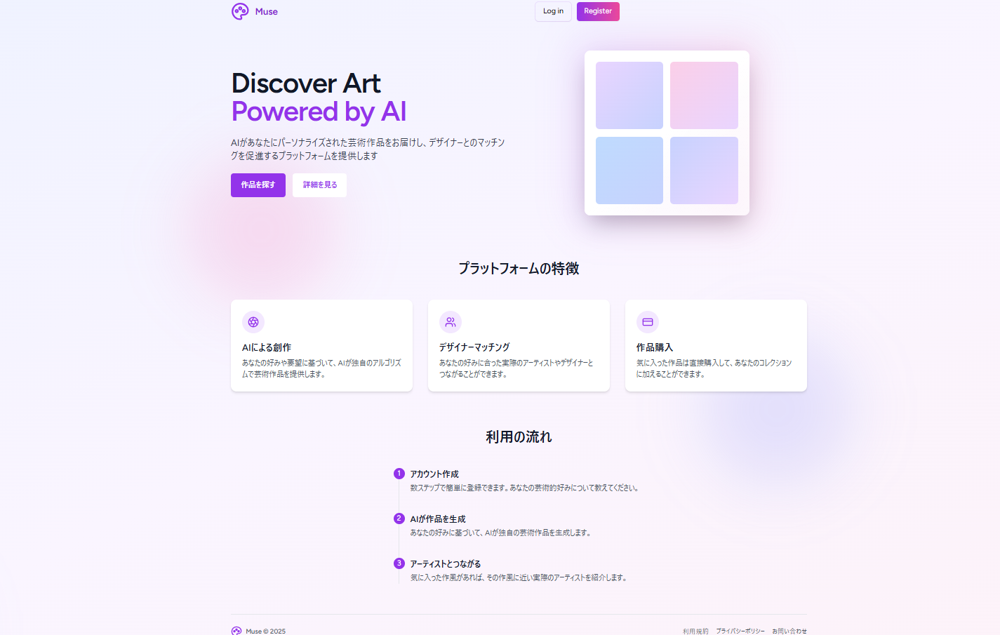
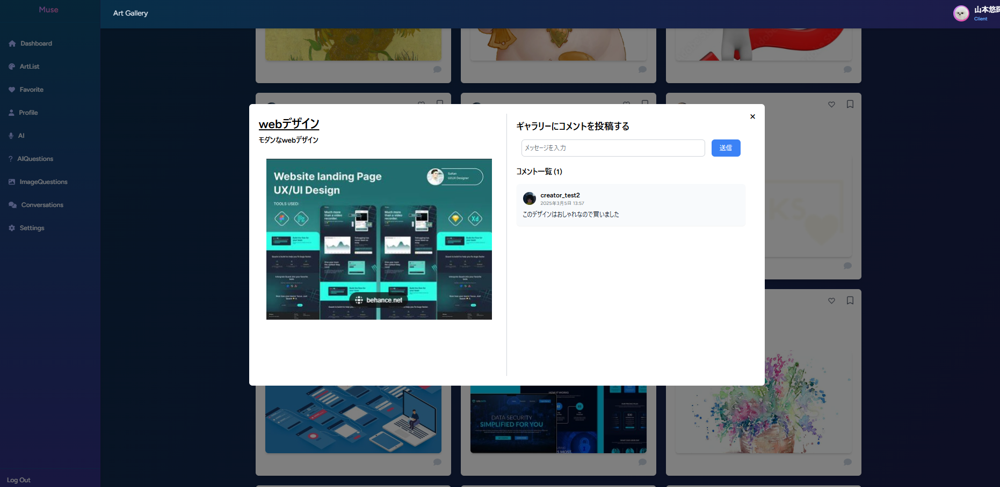
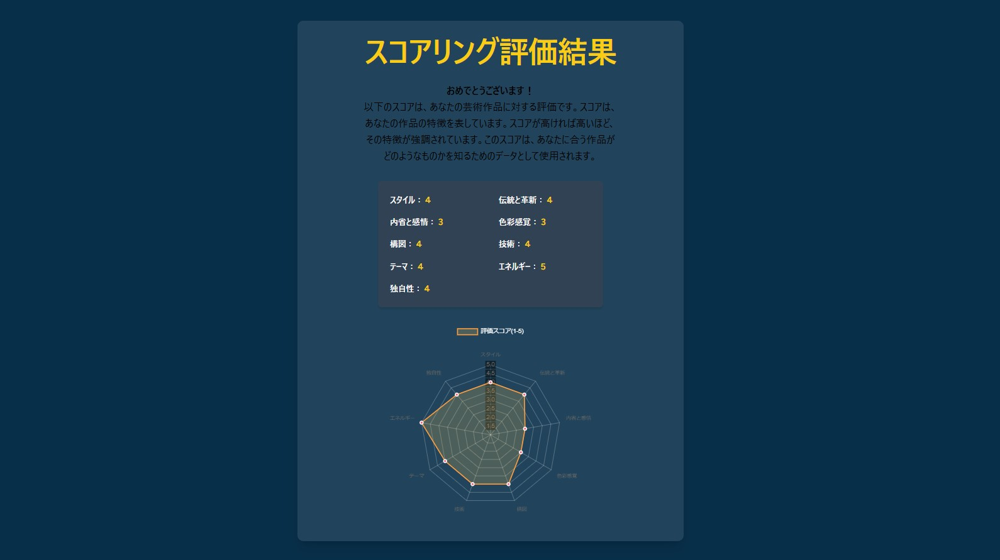

# Muse: デザイナーと企業のマッチングサービス - 要件定義

## 概要

Museは、企業が求めるイメージに合ったデザイナーと出会い、プロジェクトをスムーズに立ち上げるためのマッチングサービスです。AIを活用し、企業とデザイナー双方にとって最適なマッチングを提供します。

## 主な機能

### 1. AIによるスコアリングと最適な芸術作品の提案

*   **説明:** AIとの対話を通じて、企業のニーズや好みを詳細に把握します。
*   **詳細:**
    *   対話形式で、企業のイメージ、ターゲット層、プロジェクトの目的などをヒアリングします。
    *   収集した情報をもとに、AIが既存の作品データベースを分析し、最適な作品をスコアリングします。
    *   スコアリング結果に基づき、企業に対して最適な芸術作品を提案します。

### 2. リアルな音声AI対話によるパーソナライズ情報収集

*   **説明:** 実際の音声AIを活用し、より自然な対話を通じてパーソナライズされた情報を収集します。
*   **詳細:**
    *   音声AIとの対話により、文字だけでは伝わりにくいニュアンスや感情を把握します。
    *   対話履歴を分析し、企業の潜在的なニーズや好みを推測します。
    *   収集したパーソナライズ情報は、マッチング精度向上に活用します。

### 3. デザイナーとの連携によるプロジェクト立ち上げ支援

*   **説明:** マッチングしたデザイナーと直接やり取りを行い、プロジェクトをスムーズに立ち上げられるよう支援します。
*   **詳細:**
    *   企業は、提案された作品のデザイナーと直接コンタクトを取ることができます。
    *   プロジェクトの具体的な内容、納期、予算などをデザイナーと直接交渉できます。
    *   Museは、プロジェクトの進行状況をトラッキングし、必要に応じてサポートを提供します。

## その他

*   **UI/UX:** 直感的で使いやすいインターフェースを提供します。
*   **セキュリティ:** 個人情報保護を徹底し、安全なプラットフォームを構築します。
*   **検索機能:** 作品のジャンル、キーワード、デザイナー名などで検索できます。

## スクリーンショット

